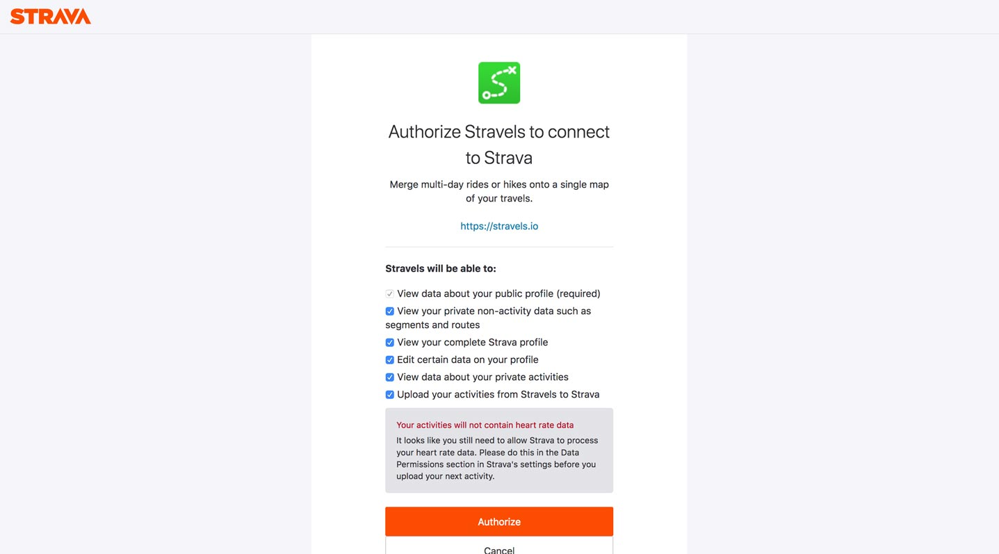

# `strava-auth-cli`


Authenticate with the Strava API from the command line:

```shell
$ strava-auth-cli --id 123456 --secret 0123456789abcdef
```

Select the scopes to allow for your token in your browser:


You get back a pair of tokens (Access and Refresh), straight from the terminal:

```
$ strava-auth-cli --id 123456 --secret 0123456789abcdef

Login {
    access_token: "2eb1da57d56f45c6a3db9c44c5594a59",
    refresh_token: "af4561aa7f754bd788223ec49f3c9f26"
}
Scopes [
    "read",
    "activity:write",
    "activity:read_all",
    "profile:write",
    "profile:read_all",
    "read_all"
]
```

It's very useful when you're at the prototyping phase of an API client.

---

The building of this project has been the subject of a
[blog article](https://francoisbest.com/posts/2019/strava-auth-cli-in-rust)
on my website.
